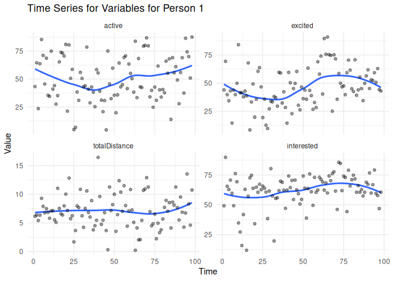

<!-- README.md is generated from README.Rmd. Please edit that file -->
<!-- knit with rmarkdown::render("README.Rmd", output_format = "md_document") -->
<!-- <\!-- badges: start -\-> -->
<!--    -->
<!--  -->
<!-- <\!-- badges: end -\-> -->

## Installation

This package is in development. The current version can be insalled with

    if (!requireNamespace("remotes")) { 
      install.packages("remotes")   
    }   
    remotes::install_github("ph-rast/dcnet")
    #> Downloading GitHub repo ph-rast/dcnet@HEAD
    #> ── R CMD build ─────────────────────────────────────────────────────────────────────────────────────────────────────────────────────────────────────────────────────────────────────────────────────────────
    #>      checking for file ‘/tmp/RtmpBZXlgw/remotes561523725de31/ph-rast-dcnet-9f7fe9d/DESCRIPTION’ ...  ✔  checking for file ‘/tmp/RtmpBZXlgw/remotes561523725de31/ph-rast-dcnet-9f7fe9d/DESCRIPTION’
    #>   ─  preparing ‘dcnet’:
    #>    checking DESCRIPTION meta-information ...  ✔  checking DESCRIPTION meta-information
    #> ─  cleaning src
    #>   ─  installing the package to process help pages
    #>      Loading required namespace: dcnet
    #>      Loading required package: cmdstanr
    #>      This is cmdstanr version 0.8.1
    #>    - CmdStanR documentation and vignettes: mc-stan.org/cmdstanr
    #>    - CmdStan path: /home/philippe/.cmdstan/cmdstan-2.35.0
    #>    - CmdStan version: 2.35.0
    #>      Compiling Stan models...
    #>      Stan models compiled successfully.
    #>   ─  saving partial Rd database
    #>   ─  cleaning src
    #>   ─  checking for LF line-endings in source and make files and shell scripts
    #>   ─  checking for empty or unneeded directories
    #>        NB: this package now depends on R (>= 3.5.0)
    #>        WARNING: Added dependency on R >= 3.5.0 because serialized objects in
    #>      serialize/load version 3 cannot be read in older versions of R.
    #>      File(s) containing such objects:
    #>        ‘dcnet/data/ema-fitbit.rda’
    #> ─  building ‘dcnet_0.0.0.9000.tar.gz’
    #>      
    #> 
    #> Installing package into '/home/philippe/R/x86_64-pc-linux-gnu-library/4.4'
    #> (as 'lib' is unspecified)

## Example: Dynamic Conditional Networks with EMA Data

This section illustrates the use with a dataset that contains synthetic
data from an ecological momentary assessment. The data is derived from a
100 Day study conducted at UC Davis (O’Laughlin et al. 2020, Willams et
al. 2020).

After loading the package, the `ema_fitbit` data is available as a list
of 38 matrices. Each matrix contains the four variables of interest:
`active`, `excited`, `totalDistance`, and `interested`. The rows
represent 98 daily observations, and the columns correspond to these
four variables. Each matrix is for one person (N=38).

    library(dcnet)

    ## Head of the data matrix for the first person:
    head(ema_fitbit[[1]])
    #>        active  excited totalDistance interested
    #> [1,] 43.27581 43.99161      6.163058   49.14676
    #> [2,] 64.61238 69.30582      6.382989   89.82558
    #> [3,] 23.61651 39.73926      5.398924   65.60202
    #> [4,] 63.72430 34.37902      6.345286   62.79230
    #> [5,] 85.38356 43.15638      9.275960   70.69611
    #> [6,] 71.11017 14.57427      7.890428   59.73196

Illustrate first person’s data. Given that `ema_fitbit` is a list, we
first need to extract person 1 and add a time index for `ggplot`:

    library(ggplot2)

    head(ema_fitbit)
    #> [[1]]
    #>          active   excited totalDistance interested
    #>  [1,] 43.275809 43.991607     6.1630581   49.14676
    #>  [2,] 64.612380 69.305820     6.3829890   89.82558
    #>  [3,] 23.616507 39.739260     5.3989242   65.60202
    #>  [4,] 63.724304 34.379019     6.3452860   62.79230
    #>  [5,] 85.383563 43.156381     9.2759603   70.69611
    #>  [6,] 71.110166 14.574269     7.8904279   59.73196
    #>  [7,] 45.625141 43.760186     6.7492124   49.24322
    #>  [8,] 68.720408 39.817067     7.4857273   76.26250
    #>  [9,] 35.515030 49.892045     6.8489231   69.36149
    #> [10,] 34.534945 84.125426     5.8052198   34.73517
    #> [11,] 75.032397 41.422321     7.1101716   27.25197
    #> [12,] 41.065457 41.612845     7.1229415   15.83581
    #> [13,] 44.203951 37.824166     5.5215415   41.80803
    #> [14,] 27.609528 42.952530     5.0812839   62.94806
    #> [15,] 35.264834 38.738222    11.0394046   11.82180
    #> [16,] 65.305529 67.905692     7.5290078   57.20870
    #> [17,] 73.938699  8.440393     6.5921905   72.57509
    #> [18,] 73.272158 33.324423     6.3701866   74.78154
    #> [19,] 70.608585 49.280933     7.9694375   63.89675
    #> [20,] 80.971465 19.799105    10.0156321   34.14033
    #> [21,] 21.321795 35.627596     7.1639653   64.80083
    #> [22,] 80.522592 60.514940    12.8394026   60.47829
    #> [23,] 50.627187 63.715375     5.7184128   67.23439
    #> [24,] 58.680865 46.699771     6.2540053   62.69550
    #> [25,]  4.932319 19.377139     1.6903838   65.69218
    #> [26,]  6.850351 35.751309     3.6615955   63.94617
    #> [27,] 38.465315 12.676705     7.9575763   60.60719
    #> [28,] 31.020542  9.715528     7.6926292   38.43961
    #> [29,] 55.950711 27.153913    10.8643376   61.59956
    #> [30,] 50.587162 33.811327     6.2376517   80.38078
    #> [31,] 43.106940 33.373207     4.2170710   57.36691
    #> [32,] 44.020648 38.130986     7.5265946   19.64790
    #> [33,] 78.651491 37.088870    10.5877819   55.35286
    #> [34,] 40.935821 29.575636     6.8176211   55.90329
    #> [35,] 28.782159 59.582407     6.0227529   61.84188
    #> [36,] 42.875922 58.957082     8.8879598   69.86587
    #> [37,] 38.374402 32.371433     3.7666366   68.91015
    #> [38,] 25.394266 42.276574     4.5070290   62.23074
    #> [39,] 58.543479 28.352066     5.4559199   47.03410
    #> [40,] 55.510719 14.471967    16.4462548   62.34043
    #> [41,] 39.122177 59.497872     9.5896562   74.07876
    #> [42,] 31.181552 50.364890     4.7481014   64.48111
    #> [43,] 20.868336 22.910101     5.4618604   70.54435
    #> [44,] 30.840259 45.158391     6.8060931   54.43413
    #> [45,]  4.556426 49.772202     3.6541329   70.76992
    #> [46,] 75.126295 60.386433     0.3062757   62.63786
    #> [47,] 45.818542 30.292972    11.2660294   59.33947
    #> [48,] 32.515438 26.272942     7.1429283   50.65258
    #> [49,] 59.831301 46.558907     8.1925219   54.52774
    #> [50,] 35.554189 36.127284     9.9961907   74.09725
    #> [51,] 19.900260 43.808365     3.5346163   63.99238
    #> [52,] 35.926471 35.665875     6.4370540   38.88292
    #> [53,] 64.348178 63.378318    12.3731171   63.66641
    #> [54,] 42.986322 43.520155    10.3839713   75.93615
    #> [55,] 45.166050 39.035522     7.0229577   60.92534
    #> [56,] 69.359022 26.732562    11.4921587   49.52819
    #> [57,] 70.766788 32.804001     8.0402756   73.00815
    #> [58,] 41.575913 28.259039     4.4339629   60.50063
    #> [59,] 63.547824 68.978707     7.1113434   62.46850
    #> [60,] 55.105097 57.978403    10.8272875   73.13804
    #> [61,] 50.398636 73.982078     7.2563636   71.30622
    #> [62,] 38.416163 40.321437     5.0872968   69.11097
    #> [63,] 83.859321 89.575386     0.2147067   62.26865
    #> [64,] 33.385351 75.596189     4.1264830   68.38429
    #> [65,] 68.361806 90.938874     2.0275246   59.93777
    #> [66,] 43.098342 75.294802     2.0916245   74.17298
    #> [67,] 42.505989 74.568084     5.4463620   70.22595
    #> [68,] 79.400737 25.079737    10.6805713   76.15074
    #> [69,] 80.114172 75.141158    10.9327708   77.74820
    #> [70,] 86.856300 71.543877    12.9048124   61.51391
    #> [71,] 79.766893 35.631164    11.2786129   46.05726
    #> [72,] 34.100092 58.615914     6.9603807   85.69456
    #> [73,] 39.898691 49.890008     4.4907575   84.72361
    #> [74,] 24.828629 46.707751     4.8629406   61.93136
    #> [75,] 42.801116 47.464725     6.5342184   74.04682
    #> [76,] 31.071007 39.706156     2.2219537   72.99751
    #> [77,] 61.603959 59.287890     4.9473951   44.31576
    #> [78,] 40.358377 70.415383     3.2963636   79.01540
    #> [79,] 33.906494 61.524154     3.7918359   65.75239
    #> [80,] 40.683616 44.941734     5.6820695   71.04853
    #> [81,] 37.756363 42.591383     7.7226973   74.90491
    #> [82,] 66.062824 70.761618     8.9299323   71.73816
    #> [83,] 55.229482 39.250837     7.0397446   60.53314
    #> [84,] 68.077309 43.941482     8.5454350   66.13867
    #> [85,] 13.978443 55.417242     4.1093583   60.50823
    #> [86,] 69.166908 45.121969     8.6402301   62.84204
    #> [87,] 55.642117 34.451772     8.0983574   57.36918
    #> [88,] 61.081142 49.862107    11.2784799   60.51040
    #> [89,] 49.100954 56.354021     7.6708527   68.96090
    #> [90,] 28.008579 61.854841     5.4987493   67.17272
    #> [91,] 55.851719 45.256231     9.5118371   76.78988
    #> [92,] 69.140916 52.919246     6.8682946   59.79553
    #> [93,] 37.472567 52.278581     4.2560060   66.83493
    #> [94,] 86.477854 59.297316     6.7206359   79.21228
    #> [95,] 74.312353 50.713338    13.5548901   59.46969
    #> [96,] 70.131935 62.925322     8.3222037   57.79593
    #> [97,] 51.041497 44.305564     4.5865737   46.91728
    #> [98,] 87.602575 42.993280    10.7452887   60.63414
    #> 
    #> [[2]]
    #>          active   excited totalDistance interested
    #>  [1,] 25.364913 27.719436     3.8797680  49.411492
    #>  [2,] 48.626432 38.698528     4.5607006  50.152721
    #>  [3,] 50.662966 53.713307    10.3527517  52.241249
    #>  [4,] 49.982997 52.378940     4.0490458  47.581941
    #>  [5,] 49.671905 51.245276     3.5239573  49.710831
    #>  [6,] 74.703478 51.792449     7.5528540  64.656322
    #>  [7,] 15.575982 21.424359     5.1371920  14.872041
    #>  [8,] 35.922183 15.099701     6.2840798  21.804227
    #>  [9,] 49.210610 20.094512     4.4885408  49.896809
    #> [10,] 51.625264 50.919532     8.7725482  52.779591
    #> [11,] 50.128030 24.502023     5.4445746  50.469687
    #> [12,] 29.149979 53.748022     2.9506975  50.574656
    #> [13,] 69.249033 53.362807     4.8676955  51.502313
    #> [14,] 51.927259 51.821201     9.6500514  51.568185
    #> [15,] 51.355148 48.490886     6.6185541  48.935548
    #> [16,] 25.017352 50.294829     5.6131561  20.353053
    #> [17,] 10.050486 21.213528     8.9495117  22.047218
    #> [18,]  9.912922 82.451481     3.6162599  51.020038
    #> [19,] 26.767125 19.260603     3.9103400  12.382361
    #> [20,] 47.728550 13.687926     3.5223686  50.231834
    #> [21,] 52.606502 14.398872     4.1782981  48.748966
    #> [22,] 13.629598  9.924876     2.6227869  13.982322
    #> [23,]  8.274052 12.753480     3.7982410   9.932411
    #> [24,] 51.499711 50.452497     4.9000719  47.767123
    #> [25,]  9.483846 52.950333     2.7518245  50.803183
    #> [26,] 13.479083 13.366144     4.0675134  50.697461
    #> [27,] 51.935123 49.306369     6.6564782  51.382305
    #> [28,] 48.770086  7.660476     4.6587216  49.835459
    #> [29,] 14.278447 10.726963     3.3081690   7.811608
    #> [30,] 11.031522  9.188991     3.8682551   4.739385
    #> [31,]  8.691977 11.919751     3.2248453   7.481694
    #> [32,] 11.599263 78.072764     2.3408400  77.062948
    #> [33,] 15.039486 87.532040     5.1827367  51.695681
    #> [34,]  6.860929  5.150498     4.1561654   8.189707
    #> [35,] 51.230789 17.318852     4.1296952  77.760764
    #> [36,] 51.257010  8.941434     7.7178859  52.802948
    #> [37,]  8.422372  9.222172     5.1080418   6.481289
    #> [38,] 49.317188 11.722455     8.5007424  12.279167
    #> [39,] 51.718873 51.951489     4.5141994  51.591089
    #> [40,] 50.493909  7.370933     3.6061523  52.615637
    #> [41,] 65.657315  6.764287     8.1817510  48.243158
    #> [42,] 49.303173 18.840937     5.4559467  51.343594
    #> [43,]  8.092782  7.821596     7.1334891   4.652475
    #> [44,] 68.605115 77.771347     4.8492317  93.310245
    #> [45,] 50.531544 51.770327     7.4107091  50.237285
    #> [46,] 50.062322 50.156733     3.9154262  50.115605
    #> [47,] 50.131378 79.517801     4.8071077  47.934620
    #> [48,]  5.765833  4.917095     3.7372729   5.635255
    #> [49,] 12.617226  8.696665     5.6916735   6.580205
    #> [50,] 28.525324  5.821116     3.7734971  37.809349
    #> [51,] 48.828914  9.296767     4.8137551   9.452770
    #> [52,] 12.292724  7.678003     3.4218837  50.060981
    #> [53,] 49.795295 51.455420     3.8966791  52.202494
    #> [54,] 48.450637  6.910768     4.4565504  49.820198
    #> [55,] 52.099863  8.582262     8.1349536  50.029816
    #> [56,] 10.709353  6.407403     0.3829470  14.931943
    #> [57,] 49.622674 46.729422     0.5870470  51.489249
    #> [58,] 50.161539 51.980139     4.5753005  52.443169
    #> [59,] 49.502940 50.322706     3.1053818  51.227677
    #> [60,] 51.164888 49.181841     4.5763713  49.623456
    #> [61,] 47.933564 39.145934     4.7593351  50.598693
    #> [62,] 50.545126 50.805388     7.3334193  51.405821
    #> [63,] 20.901643 52.055534     5.1362367  47.741051
    #> [64,] 51.799239 48.854901     4.1316513  50.161355
    #> [65,] 53.182837 84.802105     5.4850744  74.219591
    #> [66,] 53.669585  9.836515     3.5282898  50.473221
    #> [67,] 49.026925 12.580971     5.3073636  18.656920
    #> [68,] 66.583931  8.492244     6.6141231  51.362668
    #> [69,] 48.106247 10.341000     6.6156380  27.200091
    #> [70,] 51.363148 48.091471     5.3617240  51.669986
    #> [71,] 55.894910 49.672739     6.1265818  50.483204
    #> [72,] 49.792399 53.696650     6.0118941  50.478523
    #> [73,] 73.926052 71.646859     7.0161892  74.680991
    #> [74,] 49.204589 12.851020     3.8600559  49.654988
    #> [75,] 49.222947 49.517560     6.8176597  49.480798
    #> [76,] 49.509010 51.355526     5.9299679  49.079111
    #> [77,] 49.910333 52.259028     6.2306509  49.392189
    #> [78,] 50.381529 50.348075     4.7055690  48.983282
    #> [79,] 50.824899 49.300910     2.1927149  48.103916
    #> [80,] 51.264717 51.980622     5.9568863  51.568312
    #> [81,] 48.226618 15.234926     4.0542327  50.738641
    #> [82,] 50.342069 13.555991     4.3112806  53.606763
    #> [83,] 50.325092 55.647465     8.1346178  52.343047
    #> [84,] 49.714940 49.194747     3.4411310  53.234784
    #> [85,] 51.925796 49.666867     3.6034473  49.626144
    #> [86,] 50.132843 51.995687     5.3928693  52.201106
    #> [87,] 52.962615 51.459882     4.2997308  51.101845
    #> [88,] 50.334113 50.454734     6.1216766  52.805991
    #> [89,] 46.849923 50.227509     5.0478033  53.046431
    #> [90,] 48.043420 51.414879     6.2224877  48.638596
    #> [91,] 52.460272 49.222682     4.1411015  49.839403
    #> [92,] 48.186816 51.046253     9.0127529  50.517343
    #> [93,] 49.953151 50.609246     3.8699727  49.120324
    #> [94,] 52.059166 52.717892     0.6263268  50.468886
    #> [95,] 19.627747 50.430846     1.4584726  14.857688
    #> [96,] 15.784134 49.002775     3.9220175  50.548224
    #> [97,] 50.073618 48.307017     6.5621165  49.412481
    #> [98,] 51.676152 51.804765     4.1749733  51.632820
    #> 
    #> [[3]]
    #>           active    excited totalDistance interested
    #>  [1,]  88.124438 23.8900484     11.417524 46.0623436
    #>  [2,]  77.574485 45.5160630      9.734644 69.6689554
    #>  [3,]  68.657389 79.7658380      9.264667 81.9061149
    #>  [4,]  83.900874 64.0439591     10.136696 61.9994960
    #>  [5,]  75.594184 17.9052273      9.697831 18.2188110
    #>  [6,]  74.251638 73.5613291      1.073234 72.8723589
    #>  [7,]  77.166691 54.0176228      8.010316 55.9884135
    #>  [8,]  69.549178 -0.5109561     13.998690 40.5451554
    #>  [9,]  58.470332 49.5011998     10.552650 41.3111548
    #> [10,]  52.411736 49.4851328      9.862582 41.8006655
    #> [11,]  74.866175 26.7635901     11.331660 42.4902494
    #> [12,]  76.037555 77.1208334     10.221314 62.9537331
    #> [13,]  76.292034 50.7575082      9.718467 30.9960111
    #> [14,]  66.014080 19.6034355     10.736285 40.5100245
    #> [15,]  19.825899 28.0245033      7.515568 22.5900197
    #> [16,]  25.489354 12.5735476     11.074893 48.2602804
    #> [17,]  18.248027  1.0323103      5.604868 10.5815030
    #> [18,]  57.840980 43.0634484     10.205031 48.7223924
    #> [19,]  93.835340 91.2802008      7.845975 73.8519542
    #> [20,]  75.725111 22.5036813      7.079893 46.5259366
    #> [21,]  70.119143 43.0301974     10.543838 49.4172460
    #> [22,]  72.345590 47.8660110     15.547086 79.3236662
    #> [23,]  48.649731 48.8752863     10.245033 46.8996325
    #> [24,]  81.284273 42.4195975     11.291939 57.7726665
    #> [25,]  60.867568 62.4622555      8.181493 76.1661398
    #> [26,]  43.454720 18.4106369     12.515257 42.9045452
    #> [27,]  75.511006 73.0525507      5.618874 70.8529162
    #> [28,]  65.597046 46.6190156     10.704942 47.7296599
    #> [29,]  73.914600 47.5315380     12.672704 46.9903450
    #> [30,]  65.511955 23.7328948      9.018776 48.9189875
    #> [31,]  57.183207 24.6981127      9.432193 25.8233139
    #> [32,]  75.899793 63.9852962      5.550324 77.6873605
    #> [33,] 100.051766 45.6635829     21.322812 67.5464316
    #> [34,]  67.439424 25.6507528      9.325481 48.2241204
    #> [35,]  46.286091 50.2149827      8.644498 46.7086633
    #> [36,]  63.252432 43.0087546      8.471274 42.2861297
    #> [37,]  61.203127 45.3058682      9.664629 47.3690620
    #> [38,]  71.969243 68.0813168     10.394085 52.0462654
    #> [39,]  32.805621 11.5685308      9.323963 47.3874977
    #> [40,]  14.326896 28.2052308      1.577936 46.8963468
    #> [41,]  50.513409 26.1684892     12.430096 48.8713104
    #> [42,]  29.059528 69.8997850      5.715232 63.7287754
    #> [43,]  41.748380 27.9478237     11.961681 48.1442815
    #> [44,]  42.843781 25.7191480      8.030581 54.6483428
    #> [45,]  67.505784 55.9341423      8.870105 44.8267845
    #> [46,]  73.839989 81.0301049     11.191025 93.5637984
    #> [47,]  41.290206 64.2535269     10.078739 17.9601520
    #> [48,]  29.426074 45.2386272     10.283145 47.1342247
    #> [49,]  62.035281 56.7216220     10.920992 51.6993265
    #> [50,]  76.742973 48.7034800      9.993878  0.5367658
    #> [51,]  79.221113 65.5723064     11.915899 69.6005008
    #> [52,]  89.534345 75.5530055     15.866044 82.0241053
    #> [53,]  80.465972 77.9332365      4.078329 54.1575382
    #> [54,]  76.884310 46.2346628     14.722233 49.7287415
    #> [55,]  90.073265 20.1716394     12.029099 45.8836846
    #> [56,]  52.004222 80.8220955      7.713110 78.1667675
    #> [57,]  72.403483 28.7465316      9.535921 50.1969788
    #> [58,]  74.637869 64.3999553     16.651243 71.2278168
    #> [59,]  76.842842 71.2743836     22.826296 76.1106269
    #> [60,]  62.251116 29.4016132      8.490834 17.3593646
    #> [61,]  53.164098 28.8013029     10.755460 47.4611695
    #> [62,]  63.434214 31.6848997      9.206568 65.9856406
    #> [63,]  48.401345 28.7620518     10.410834 71.1249566
    #> [64,]  80.555464 51.9886969      8.886251 72.0254543
    #> [65,]  74.994379 49.6974511      8.582071 50.3739553
    #> [66,]  83.865168 55.7330078     12.471156 74.6567590
    #> [67,]  79.520531 47.6113842      9.543746 49.2059794
    #> [68,]  53.014593 54.6990803     11.072656 48.6815938
    #> [69,]  66.303730 33.7329881     11.354968 82.4778914
    #> [70,]  62.561649 23.9569694     11.220732 51.4636469
    #> [71,]  46.051724 48.3594777      7.710516 44.5597837
    #> [72,]  69.130928 47.1472230     11.195796 67.8394690
    #> [73,]  58.204654 23.7901854      9.890394 52.1715096
    #> [74,]  74.625132 50.6011365     11.056776 53.0175196
    #> [75,]  66.621328 30.4604905     10.801667 47.5483901
    #> [76,]  80.552644 48.0312831     11.656456 48.2727008
    #> [77,]  47.958179 43.7949435      7.496518 31.5670059
    #> [78,]   2.836136 31.6282251      1.397983 45.6181556
    #> [79,]   6.786120 -0.7776255      7.266335 24.2983869
    #> [80,]  25.657356 21.5217959      5.737211 49.8240867
    #> [81,]  23.450785 22.6318971      5.485322 46.5086344
    #> [82,]  32.337159 36.7202055      9.401257 25.3306163
    #> [83,]  31.643480 28.0561880      7.198143 72.8122008
    #> [84,]  66.297179 21.7328896      9.994104 68.2066216
    #> [85,]  46.133063 46.0700502      8.883889 61.2211593
    #> [86,]  67.218489 67.3903021     13.258147 71.9476869
    #> [87,]  74.460061 46.0130888      8.217126 67.5430164
    #> [88,]  71.162041 61.4024563     13.332843 47.2704364
    #> [89,]  46.215592 74.4790886      6.743937 74.5488031
    #> [90,]  77.503177 81.4417280      8.477757 73.3633341
    #> [91,]  71.050958 81.3464580      7.123003 75.9808747
    #> [92,]  77.573747 27.8019446      8.804391 66.5085397
    #> [93,]  82.913461 48.4608585     10.247990 81.2887685
    #> [94,]  88.624227 85.9376654     21.077751 80.7652017
    #> [95,]  65.879780 68.1275050     11.436081 71.8683371
    #> [96,]  32.811334 39.4525434      2.970866 83.4622870
    #> [97,]  77.857611 43.1595464      9.888681 74.3217948
    #> [98,]  42.451418 17.5764376      8.729173 30.0199446
    #> 
    #> [[4]]
    #>          active  excited totalDistance interested
    #>  [1,]  93.63784 90.72394    9.87422534   87.09648
    #>  [2,]  88.76963 81.11620    4.82865344   86.32106
    #>  [3,]  57.69659 50.57851    4.41020231   88.38293
    #>  [4,]  84.33835 69.37618   17.40494986   86.66306
    #>  [5,] 101.09844 84.76185    6.40294783   91.83492
    #>  [6,]  87.14028 50.96531    4.37471340   91.74023
    #>  [7,]  51.48749 55.56735    7.84663751   67.21319
    #>  [8,]  92.08749 80.20954   11.25799314   94.65173
    #>  [9,]  97.96423 60.87695    3.39846976   78.63093
    #> [10,]  64.81012 53.98414    6.63690968   65.26867
    #> [11,]  67.76484 69.87373   18.31206035   76.42414
    #> [12,]  97.77546 89.65164    4.43856984   92.61820
    #> [13,]  31.35441 53.19464    5.49026504   51.33474
    #> [14,]  69.75927 67.30634    6.70662940   71.33892
    #> [15,]  90.50803 79.85037    7.36794774   65.98811
    #> [16,]  67.97048 78.93117    4.62970656   72.08922
    #> [17,]  52.79554 70.43991    4.70479227   78.63403
    #> [18,]  40.51167 74.53396   19.81002957   69.80877
    #> [19,]  98.36165 90.88611   11.88532087   82.38341
    #> [20,]  85.33838 93.82556    4.88668112   86.00654
    #> [21,]  70.21454 78.54476    8.56340720   79.02420
    #> [22,]  87.60900 88.17629    7.96433279   83.61924
    #> [23,]  87.76311 85.84834    4.38026643   69.43436
    #> [24,]  71.85355 59.37158    2.86870359   78.62206
    #> [25,]  62.54216 50.75694   22.58173350   55.90526
    #> [26,]  95.65194 80.94121    3.97695959   84.81193
    #> [27,]  28.78450 35.81032    4.24820609   46.70570
    #> [28,]  34.20274 42.74962    4.18510650   58.82547
    #> [29,]  54.27053 48.15169    3.74513958   51.00113
    #> [30,]  35.19285 45.65605    7.39513039   62.76577
    #> [31,]  64.69164 60.91373    1.29622901   60.97706
    #> [32,]  23.25851 28.68320    8.34916507   57.09612
    #> [33,]  68.48731 69.92997    4.61531487   63.11141
    #> [34,]  51.43471 40.18226    3.19155305   73.21900
    #> [35,]  46.00548 39.50169    4.66016999   50.85827
    #> [36,]  44.63140 40.21715    8.48092192   47.08088
    #> [37,]  95.83736 67.81844    4.42378886   70.24270
    #> [38,]  69.96605 63.39482    4.87028775   60.48769
    #> [39,]  60.67883 80.64460   13.55527070   76.11560
    #> [40,]  87.23590 75.14927    6.11663209   79.07089
    #> [41,]  60.59569 69.47386    4.84064963   68.73235
    #> [42,]  62.29890 59.73441    4.26605124   59.24627
    #> [43,]  71.21993 57.21335    8.23258880   64.35224
    #> [44,]  79.26499 74.01024    2.89957984   65.30646
    #> [45,]  62.27251 67.24480    7.13598738   77.39419
    #> [46,]  77.27521 66.57043   27.94072031   64.76143
    #> [47,]  90.11802 91.73176    4.26071331   69.59125
    #> [48,]  59.47253 65.34662    4.53714789   58.51701
    #> [49,]  65.07526 67.97622    8.21563993   63.51598
    #> [50,]  82.10728 78.97583    4.34241419   69.43636
    #> [51,]  74.67046 75.48315   -0.01031936   77.38035
    #> [52,]  68.22075 64.43177    8.46721751   68.56242
    #> [53,]  82.61911 71.32630    7.55547270   71.88408
    #> [54,]  71.27133 72.39082    5.87601790   68.96913
    #> [55,]  76.61948 62.84574    4.59010548   59.24592
    #> [56,]  70.27137 70.98297    9.87473736   72.88356
    #> [57,]  84.87793 77.62515    6.41954720   75.81789
    #> [58,]  81.97111 73.46933    0.30599438   75.14080
    #> [59,]  73.24933 68.94285    8.13224842   78.83718
    #> [60,]  84.43846 80.98204    8.28515498   82.19200
    #> [61,]  81.41631 81.90001    8.41718026   76.58432
    #> [62,]  84.35579 82.69936    9.72595137   74.47914
    #> [63,]  87.58732 70.79481    8.28811333   76.50155
    #> [64,]  86.12614 75.91200    3.66662857   79.07719
    #> [65,]  71.24260 73.22223    3.31097995   75.24059
    #> [66,]  79.64852 78.64481    4.40188752   72.60167
    #> [67,]  71.76283 75.37069    5.88698450   72.06973
    #> [68,]  68.09559 66.65595    3.47023976   74.29594
    #> [69,]  76.27076 75.45682    4.95962638   68.53330
    #> [70,]  70.00668 71.75649    4.41727900   69.90652
    #> [71,]  77.91973 71.36954    7.50839075   75.76955
    #> [72,]  81.71105 78.15243    6.76937181   74.37874
    #> [73,]  77.99283 73.22612    5.63345103   76.91539
    #> [74,]  84.68030 77.67058    3.27513861   79.46219
    #> [75,]  80.60093 78.41053    8.25683443   76.75540
    #> [76,]  83.72780 74.12805    4.37473974   77.01882
    #> [77,]  71.86333 74.81520    6.97705486   74.94473
    #> [78,]  86.68816 84.52764    8.77219076   79.23022
    #> [79,]  77.19770 72.19137    6.57318822   65.32413
    #> [80,]  83.03180 82.10769    3.55863778   85.08955
    #> [81,]  81.27890 81.18899    2.65885233   75.05938
    #> [82,]  51.83196 62.71588    4.13993737   72.51903
    #> [83,]  69.43487 79.93411    6.05192584   69.45198
    #> [84,]  71.46849 60.52495    3.78218177   64.74775
    #> [85,]  69.30101 76.13454    9.24553013   72.97268
    #> [86,]  74.96735 73.30785   12.46862109   76.84697
    #> [87,]  83.86244 65.89376    7.68515467   76.34965
    #> [88,]  74.01986 70.91862    8.33754605   76.50611
    #> [89,]  88.19860 82.30199    8.66661961   78.01258
    #> [90,]  81.71595 75.44653    4.27316989   79.88660
    #> [91,]  79.42075 78.18963    4.85617280   80.54930
    #> [92,]  68.44617 74.97196    8.51303008   66.11529
    #> [93,]  73.51355 72.74391    9.69229591   82.91430
    #> [94,]  71.31030 81.51446    7.26441488   74.87065
    #> [95,]  83.15187 80.72459    4.91592806   83.08838
    #> [96,]  80.43976 76.36814    7.71387360   80.13903
    #> [97,]  76.74722 79.09029    2.34059271   82.55642
    #> [98,]  70.10808 79.08937    0.02957459   75.05286
    #> 
    #> [[5]]
    #>          active   excited totalDistance interested
    #>  [1,] 11.892492 18.299853     3.6762071  27.149283
    #>  [2,] 21.156428 18.037379     8.8929807   2.581010
    #>  [3,] 41.918053 22.150485     0.6631655  35.125173
    #>  [4,] 31.177906 31.505628     1.7449882  28.369897
    #>  [5,] 58.952310 28.116903    10.2657600  23.533998
    #>  [6,] 24.132277 14.374307     7.9715109  20.331044
    #>  [7,] 26.389027  8.586130     4.0634756  34.164039
    #>  [8,] 13.600974 28.062179    10.0356020  21.361708
    #>  [9,] 48.703232 26.870150    10.7880262  45.027893
    #> [10,] 41.662203 34.300303    10.4287074  21.652929
    #> [11,] 77.126562 94.007460    10.3845015  94.032269
    #> [12,] 75.791267 98.295587     1.9518542  96.408983
    #> [13,] 48.528446 44.712028     4.8001755  50.674382
    #> [14,] 49.397239 29.266796     6.8907346  23.696170
    #> [15,]  9.217336 17.129363    10.3428786  28.578281
    #> [16,] 33.010662 40.016163    10.2740038  29.953797
    #> [17,] 29.618268 19.732100    10.9395559  25.275608
    #> [18,] 27.113293 24.951322    10.0745341  18.368722
    #> [19,] 42.742342 61.276117     2.3254449  31.496916
    #> [20,] 39.994102 24.326695     3.6283884  50.669996
    #> [21,] 48.379715 11.943376     4.2499008  17.886603
    #> [22,] 13.906199 24.985458     6.6366374   6.934528
    #> [23,] 16.382013 15.238513     9.4433290  18.396821
    #> [24,] 26.285843 14.032698     8.2909347  22.805847
    #> [25,] 15.533980 44.732308     1.2685433  21.639469
    #> [26,] 29.331993 25.091894     3.3663612  20.214630
    #> [27,] 26.363312 22.089460     6.6328807  22.055336
    #> [28,] 15.225089 18.676742     9.0176409  14.519521
    #> [29,] 14.495816 21.145724     9.6335717  20.021472
    #> [30,] 21.041759 15.364706     9.5025652  16.220800
    #> [31,] 17.689637 38.557544     9.3907920  37.339766
    #> [32,] 32.338535 42.005527     9.1466792  32.528492
    #> [33,] 43.578511 40.195303     2.9538411  49.179729
    #> [34,] 43.282958 40.046369     2.0368447  41.630463
    #> [35,] 39.314054 35.801969     9.1480084  41.863684
    #> [36,] 22.223261 27.614043     9.4965163  15.029997
    #> [37,] 23.696155 22.426020     9.6471884  17.380342
    #> [38,] 37.942225 48.403365     0.6248202  45.194122
    #> [39,] 46.620341 46.306046     7.1020487  48.654591
    #> [40,] 41.440188 38.632854     3.6949775  36.901453
    #> [41,] 18.094829 24.570789     7.7805299  21.783446
    #> [42,] 47.416056 28.544651     9.5251565  46.589048
    #> [43,] 21.356746 25.663711     9.9592260  20.017178
    #> [44,] 43.789388 51.116641     9.7582392  39.683263
    #> [45,] 37.874973 39.541733     1.9575381  47.130698
    #> [46,] 38.314032 31.406283     9.2161103  31.297039
    #> [47,] 17.079379 22.929392     6.1378402  21.431921
    #> [48,] 40.548525 38.849287     9.1863681  35.405085
    #> [49,] 30.571926 31.354777     9.3967288  24.816922
    #> [50,] 40.103492 41.554450     9.7333138  52.378990
    #> [51,] 36.624674 20.909999     7.6495033  38.996899
    #> [52,] 43.575007 50.328880     8.9528172  51.111173
    #> [53,] 44.756331 39.163416     2.5347919  48.310750
    #> [54,] 53.996663 43.684641     3.2555794  49.268382
    #> [55,] 49.502327 38.502964    10.6459631  39.889880
    #> [56,] 29.403792 36.363789     8.8499536  30.690620
    #> [57,] 19.167780 40.626503     8.9838535  14.015915
    #> [58,] 40.582261 43.071480     9.4029619  47.036524
    #> [59,] 40.221444 42.150452     8.3482819  42.984110
    #> [60,] 43.727396 41.302452     3.9827580  44.453496
    #> [61,] 39.708022 20.359077     7.6600873  39.661015
    #> [62,] 40.221801 16.773737     9.1792845  41.127069
    #> [63,] 30.005256 30.946446     9.8129291  36.764410
    #> [64,] 34.420724 18.725723    10.0606644  39.259970
    #> [65,] 35.781072 31.187886     8.6117473  32.371522
    #> [66,] 28.202333 41.689450     9.3814947  38.814809
    #> [67,] 36.650293 49.557739     3.7887262  34.725105
    #> [68,] 37.693481 32.611987     5.0984146  44.535609
    #> [69,] 42.497043 26.295401     8.7103018  34.784426
    #> [70,] 45.380421 50.401707     5.5642969  44.249171
    #> [71,] 37.469753 30.252685    10.6234396  53.713302
    #> [72,] 40.510681 36.552124     8.7893131  41.003696
    #> [73,] 49.911992 28.486379     9.1174053  53.396659
    #> [74,] 47.872850 50.610283     3.4812158  51.153376
    #> [75,] 49.137432 51.064623     5.5556936  51.227268
    #> [76,] 53.876016 32.544996    10.7382327  48.035422
    #> [77,] 27.555887  6.275532     9.4116138   3.403188
    #> [78,] 37.465657 40.750976     9.5080518  25.301324
    #> [79,] 54.220050 33.114903     7.1845828  52.385565
    #> [80,] 43.770039 26.219673     8.1596538  41.854785
    #> [81,] 37.472607 44.742798     3.1544662  46.670066
    #> [82,] 53.966288 32.088791     5.6215717  38.164382
    #> [83,] 43.336160 51.019067     7.9071181  48.083969
    #> [84,] 41.084752 41.506686     5.5774932  46.366506
    #> [85,] 37.120852 31.088271     5.7789161  39.704214
    #> [86,] 51.458472 55.169044     8.1644411  49.425576
    #> [87,] 35.327817 32.774424     7.4179022  39.261408
    #> [88,] 35.130861 31.373250     3.0676793  44.953623
    #> [89,] 47.316802 49.900403     1.8220415  48.664609
    #> [90,] 35.990642 35.967095     7.7527745  34.775255
    #> [91,] 40.159401 26.797773     1.4504026  30.256254
    #> [92,] 38.501273 39.406510     7.7096747  38.563499
    #> [93,] 56.650679 49.530406     7.4272450  51.291382
    #> [94,] 35.135898 36.882673     6.7959088  35.375004
    #> [95,] 37.987814 33.512315     2.1198594  39.209712
    #> [96,] 27.937068 28.724756     4.6191087  41.591828
    #> [97,] 40.024270 35.141573     7.8525210  37.346215
    #> [98,]  9.342547 10.749605     8.0434286   9.213632
    #> 
    #> [[6]]
    #>          active    excited totalDistance interested
    #>  [1,] 68.882398 68.4722891     14.317953  54.918220
    #>  [2,] 86.518683 28.0556188     16.810877  56.135550
    #>  [3,] 67.371400 40.9948362     14.840163  63.171096
    #>  [4,] 66.283789 57.1573771     17.458525  37.741264
    #>  [5,] 63.385709 57.9850297     15.427169  82.425262
    #>  [6,] 80.598706 27.8532416     29.613717  64.717079
    #>  [7,] 47.494748 30.0019452      5.080999  66.747041
    #>  [8,] 81.299799 20.7858796      1.383985  53.734564
    #>  [9,] 84.015681 36.5622399     16.390615  41.985245
    #> [10,]  7.170613 56.3642361      8.983835  63.103331
    #> [11,] 63.763975 56.6712113     17.386897  58.128203
    #> [12,] 58.200843 25.7448196     15.159736  36.132329
    #> [13,] 64.279314 30.4114148     27.522925  58.944997
    #> [14,] 41.279207 31.0305426      6.791058  55.736267
    #> [15,] 65.934461  0.4389959     18.858991  32.797053
    #> [16,] 73.282304 64.6844498     15.565330  40.437149
    #> [17,] 60.493240 37.3684142     15.134651  29.548304
    #> [18,] 65.333530 40.0106584     20.158867  27.533101
    #> [19,] 58.544885 40.2954067     20.659794  26.603466
    #> [20,] 72.212252 19.0924511     30.059601  53.750001
    #> [21,] 34.452432 18.9424783      7.337330  53.509270
    #> [22,] 40.047577 20.7411740     15.641443  12.518719
    #> [23,] 64.296350 39.2487872     15.353614  51.976841
    #> [24,] 42.895408 40.0120376     17.003382  62.457706
    #> [25,] 23.103891 43.7239676     15.289486  53.036796
    #> [26,] 32.277447 39.1240859     18.466732  49.550108
    #> [27,] 68.226882 52.7576808     27.367418  31.950996
    #> [28,] 44.561480 24.4340378      5.138750  44.838311
    #> [29,] 37.544430 36.6426616     18.015240  59.608025
    #> [30,] 48.230394 39.7408416     17.368303  48.858210
    #> [31,] 34.329773 34.1209579     15.295623  47.155887
    #> [32,] 64.564595 18.1388734     18.027257  52.211607
    #> [33,] 47.897102 37.7554733     15.280442  57.782419
    #> [34,] 79.385504 17.5788850     31.519261  59.006464
    #> [35,] 23.416943 37.5728008      7.673876  35.626586
    #> [36,] 60.247752 26.1240721     17.757105  22.362428
    #> [37,] 12.642026 30.3631904     15.773919  46.874677
    #> [38,] 29.952719 30.4486505      5.215545  50.400165
    #> [39,] 57.756096 46.2637164     18.906703  39.465638
    #> [40,] 55.809651 32.5711017     16.060660  49.374772
    #> [41,] 55.826890 24.4087860     22.503279  41.101843
    #> [42,] 15.144618 38.4838186      7.702766  39.964476
    #> [43,] 44.217219 21.0823844     17.846982  11.490219
    #> [44,] 48.122530 24.6579301     17.804949  21.050930
    #> [45,] 44.957998 22.2836098     15.044131  43.454963
    #> [46,] 41.847950 12.5663340     19.272252  36.167532
    #> [47,] 66.678113 62.1510752     34.172134  35.061639
    #> [48,] 28.365358 14.0230423      6.785222  24.959332
    #> [49,] 35.174699 41.4804018     17.463143  33.325702
    #> [50,] 66.741934 20.9124134     15.219442  29.737497
    #> [51,] 13.858309 23.9626649      6.054478  18.527984
    #> [52,] 48.764824 22.3678099     17.271856  33.203578
    #> [53,] 29.099534 23.6021898     21.835646  54.492758
    #> [54,] 71.528635 52.5095780     26.184081  34.025437
    #> [55,] 33.973817 23.2983363      7.647475  51.113461
    #> [56,] 33.626879 37.3770292     14.587858  27.863226
    #> [57,] 34.708529 23.3235065     11.373797  27.241555
    #> [58,] 28.353332 34.7704408      8.033939  36.035347
    #> [59,] 23.997642 36.8245730      5.912508  28.514666
    #> [60,] 18.043396 41.2198055     13.851646  14.694028
    #> [61,] 17.410235 26.1788144     20.662095  22.763742
    #> [62,] 36.422838 29.2038850      2.830216  37.078858
    #> [63,] 34.044610 31.3591649      9.624306  34.110733
    #> [64,] 23.309160 23.1785859     11.047541  46.991891
    #> [65,] 37.389096 45.5887994      5.915068  40.270422
    #> [66,] 51.032524 54.8936026     18.540337  35.133271
    #> [67,] 48.209942 46.5712217     11.329340  28.058197
    #> [68,] 32.445739 26.4018020     51.585837  25.049055
    #> [69,] 27.862797 35.5342869      3.260425  27.581142
    #> [70,] 33.980249 32.8954920      4.614686  27.603175
    #> [71,] 17.075634 34.8187574      3.328883  32.261738
    #> [72,]  2.533816 23.2304054      2.830108  29.913293
    #> [73,] 26.242518 27.7262013     12.404968  20.411985
    #> [74,] 22.131359 19.5787025      7.358103  22.892503
    #> [75,] 27.859451 15.0038890      5.806972  24.794457
    #> [76,] 13.416738 26.7025984      4.225831  35.692853
    #> [77,]  9.751073 26.9415617      4.790882  51.465239
    #> [78,]  7.379880 34.2582123      3.246066  27.768510
    #> [79,] 31.802252 25.7530131      5.466609  28.291661
    #> [80,] 19.772331 27.1914273      3.371427  25.781985
    #> [81,] 26.783292 27.8045316      4.434832  24.770682
    #> [82,] 25.312983 22.0238312      1.824426  32.807296
    #> [83,] 29.368634 21.9314291      4.090775  22.874361
    #> [84,] 16.039085 24.4892462      5.786846  23.566998
    #> [85,] 19.183943 21.5621661      5.191493  23.241622
    #> [86,] 20.769907 11.9639125      4.819787  24.297931
    #> [87,] 32.762112 36.9073012      7.519275  17.641696
    #> [88,] 22.237397  8.1301634      7.368436   9.353388
    #> [89,]  8.624237 24.2999638      5.874320  17.936044
    #> [90,] 38.270176 20.2045505      4.329435  34.867900
    #> [91,] 21.135927 22.1216857      6.937136  23.532398
    #> [92,] 14.693341 33.4094974      3.653604  33.854948
    #> [93,] 16.357535 28.7513364      5.599506  30.555272
    #> [94,] 28.425588 27.7287351      8.408131  44.346163
    #> [95,] 40.839465 26.6963386      6.421201  34.810112
    #> [96,] 24.509210 23.5970278      4.822261  13.255446
    #> [97,] 10.739975 21.4398428      4.822171  24.902568
    #> [98,] 20.977959 27.2114492      4.820925  27.114854
    df1 <- data.frame(ema_fitbit[[1]], time = 1:98)

    ## Manually reshape the data to long format using base R
    df1_long <- do.call(rbind, lapply(names(df1)[-5], \(var) {
      data.frame(time = df1$time, variable = var, value = df1[[var]])
    }))

    ## Convert the 'variable' column to a factor for consistent ordering in facets
    df1_long <- df1_long |>
      within({ variable <- factor(variable, levels = names(df1)[-5]) })

    ## Plot with ggplot2
    plt <- ggplot(df1_long, aes(x = time, y = value)) +
      geom_smooth(show.legend = FALSE, se = FALSE) +
      geom_point(alpha = 0.4) +
      facet_wrap(~ variable, scales = "free_y") +
      labs(x = "Time", y = "Value", title = "Time Series for Variables for Person 1") +
      theme_minimal()

    plt
    #> `geom_smooth()` using method = 'loess' and formula = 'y ~ x'

## Fit Dynamic Conditional Correlation (DCC) Network Model

Next we will fit the multilevel DCC model for the shocks, the residual
conditional covariances, and a multilevel VAR structure for means
structure.

The function `dcnet` reads the data in the structure given in
`ema_fitbit`. The `parameterization = "DCCr"` selects the DCC with
random effects on all components, the garch parameters for the standard
deviations as well as all garch parameters for the conditional
correlations. In order to shorten computation time, we will use
`sampling_algorithm = 'variational'`. `variational` employs Stan’s
variational inference algorithm that approximates the posterior via the
“meanfield” algorithm. For full sampling, one could use `hmc`, but this
option will need to run hours and days to converge. The `init = 0.5`
argument is optional, but works well to create good starting values that
don’t stray too far.

## Fitting the Multilevel DCC Model

Next, we will fit the **multilevel DCC model** to estimate the shocks,
the residual conditional covariances, and a **multilevel VAR structure**
for the mean.

The `dcnet()` function reads the data provided in the structure of
`ema_fitbit`. Setting the argument `parameterization = "DCCr"` selects
the **DCC model with random effects** on all components. This includes
random effects for both the **GARCH parameters** governing the standard
deviations and the **GARCH parameters** for the conditional
correlations.

To shorten computation time, we will use
`sampling_algorithm = "variational"`. The `variational` algorithm
employs **Stan’s variational inference** to approximate the posterior
distribution using the **meanfield** approximation. For full Bayesian
sampling, one could set `sampling_algorithm = "hmc"`. However, this
option is computationally expensive and may take several hours or even
days to converge.

The argument `init = 0.5` is optional but often useful, as it provides
reasonable starting values that help the algorithm converge faster
without straying too far from the posterior space.

    fit <- dcnet(data = ema_fitbit, parameterization = "DCCr",
                 sampling_algorithm = 'variational', init = 0.5)
    #> ------------------------------------------------------------ 
    #> EXPERIMENTAL ALGORITHM: 
    #>   This procedure has not been thoroughly tested and may be unstable 
    #>   or buggy. The interface is subject to change. 
    #> ------------------------------------------------------------ 
    #> Gradient evaluation took 0.033729 seconds 
    #> 1000 transitions using 10 leapfrog steps per transition would take 337.29 seconds. 
    #> Adjust your expectations accordingly! 
    #> Begin eta adaptation. 
    #> Iteration:   1 / 250 [  0%]  (Adaptation) 
    #> Iteration:  50 / 250 [ 20%]  (Adaptation) 
    #> Iteration: 100 / 250 [ 40%]  (Adaptation) 
    #> Iteration: 150 / 250 [ 60%]  (Adaptation) 
    #> Iteration: 200 / 250 [ 80%]  (Adaptation) 
    #> Iteration: 250 / 250 [100%]  (Adaptation) 
    #> Success! Found best value [eta = 0.1]. 
    #> Begin stochastic gradient ascent. 
    #>   iter             ELBO   delta_ELBO_mean   delta_ELBO_med   notes  
    #>    100  -2685889328.197             1.000            1.000 
    #>    200    -53643908.439            25.034           49.069 
    #>    300  -163194105309.589            17.023            1.000 
    #>    400    -10114855.667          4046.042           49.069 
    #>    500     -4518374.772          3237.082            1.239 
    #>    600     -6048021.675          2697.610            1.239 
    #>    700     -1215913.477          2312.805            1.239 
    #>    800     -1532259.509          2023.730            1.239 
    #>    900      -434185.811          1799.152            1.239 
    #>   1000      -436320.366          1619.238            1.239 
    #>   1100      -210342.598          1472.132            1.074   MAY BE DIVERGING... INSPECT ELBO 
    #>   1200      -137885.096          1349.498            1.074   MAY BE DIVERGING... INSPECT ELBO 
    #>   1300      -115739.524          1245.705            1.000   MAY BE DIVERGING... INSPECT ELBO 
    #>   1400      -110751.784          1156.729            1.000   MAY BE DIVERGING... INSPECT ELBO 
    #>   1500       -92013.309          1079.628            1.000   MAY BE DIVERGING... INSPECT ELBO 
    #>   1600       -84147.264          1012.157            1.000   MAY BE DIVERGING... INSPECT ELBO 
    #>   1700       -79426.537           952.622            0.525   MAY BE DIVERGING... INSPECT ELBO 
    #>   1800       -76083.371           899.701            0.525   MAY BE DIVERGING... INSPECT ELBO 
    #>   1900       -73423.078           852.350            0.253   MAY BE DIVERGING... INSPECT ELBO 
    #>   2000       -71581.134           809.734            0.253   MAY BE DIVERGING... INSPECT ELBO 
    #>   2100       -70091.613           771.176            0.206   MAY BE DIVERGING... INSPECT ELBO 
    #>   2200       -68162.477           736.124            0.206   MAY BE DIVERGING... INSPECT ELBO 
    #>   2300       -66703.220           704.119            0.204   MAY BE DIVERGING... INSPECT ELBO 
    #>   2400       -65755.718           674.782            0.204   MAY BE DIVERGING... INSPECT ELBO 
    #>   2500       -64975.810           647.791            0.191   MAY BE DIVERGING... INSPECT ELBO 
    #>   2600       -64107.268           622.876            0.191   MAY BE DIVERGING... INSPECT ELBO 
    #>   2700       -63223.233           599.807            0.093   MAY BE DIVERGING... INSPECT ELBO 
    #>   2800       -62653.666           578.386            0.093   MAY BE DIVERGING... INSPECT ELBO 
    #>   2900       -62059.795           558.442            0.059   MAY BE DIVERGING... INSPECT ELBO 
    #>   3000       -61234.350           539.828            0.059   MAY BE DIVERGING... INSPECT ELBO 
    #>   3100       -60983.746           539.795            0.045   MAY BE DIVERGING... INSPECT ELBO 
    #>   3200       -60434.985           538.159            0.044   MAY BE DIVERGING... INSPECT ELBO 
    #>   3300       -59931.945           538.126            0.036   MAY BE DIVERGING... INSPECT ELBO 
    #>   3400       -59790.685             0.356            0.028 
    #>   3500       -59219.963             0.315            0.026 
    #>   3600       -59041.357             0.307            0.022 
    #>   3700       -58648.738             0.175            0.021 
    #>   3800       -58357.231             0.168            0.014 
    #>   3900       -58136.205             0.084            0.014 
    #>   4000       -57723.637             0.084            0.014 
    #>   4100       -57462.212             0.048            0.014 
    #>   4200       -57343.771             0.031            0.013 
    #>   4300       -57133.164             0.024            0.012 
    #>   4400       -56796.642             0.023            0.010   MEDIAN ELBO CONVERGED 
    #> Drawing a sample of size 1000 from the approximate posterior...  
    #> COMPLETED. 
    #> Finished in  223.1 seconds.

Once the model is fit, we can request a summary (check your RAM – this
step might kill R if you are close to maxing out your memory):

    summary(fit)
    #> Model: mlVAR-DCCr
    #> Basic Specification: H_t = D_t R D_t
    #>  diag(D_t) = sqrt(h_ii,t) = c_h + a_h*y^2_[t-1] + b_h*h_[ii,t-1]
    #>  R_t = Q^[-1]_t Q_t Q^[-1]_t = ( 1 - a_q - b_q)S + a_q(u_[t-1]u'_[t-1]) + b_q(Q_[t-1])
    #> 
    #> Sampling Algorithm:  variational
    #> Distribution:  Gaussian
    #> ---
    #> Iterations:  30000
    #> Chains:  4
    #> Date:  Fri Oct 25 19:12:00 2024
    #> Elapsed time (min):  3.72
    #> 
    #> GARCH(1,1)  estimates for conditional variance on D:
    #> 
    #>             mean   sd   mdn 2.5% 97.5%
    #> c_h_tau_ac  0.59 0.07  0.59 0.47  0.74
    #> c_h_tau_ex  0.46 0.05  0.45 0.37  0.56
    #> c_h_tau_tD  0.50 0.05  0.50 0.41  0.62
    #> c_h_tau_in  0.72 0.05  0.72 0.63  0.82
    #> a_h_tau_ac  0.16 0.03  0.16 0.11  0.24
    #> a_h_tau_ex  0.26 0.06  0.25 0.17  0.39
    #> a_h_tau_tD  0.10 0.03  0.10 0.05  0.19
    #> a_h_tau_in  0.31 0.05  0.30 0.22  0.41
    #> b_h_tau_ac  0.79 0.22  0.76 0.44  1.30
    #> b_h_tau_ex  0.57 0.23  0.53 0.26  1.12
    #> b_h_tau_tD  0.22 0.06  0.21 0.12  0.36
    #> b_h_tau_in  0.37 0.10  0.35 0.21  0.59
    #> c_h_ac      7.98 1.09  7.88 6.05 10.28
    #> c_h_ex     11.44 1.45 11.34 9.01 14.41
    #> c_h_tD      1.80 0.21  1.77 1.43  2.26
    #> c_h_in      6.40 0.64  6.37 5.24  7.70
    #> a_h_ac      0.16 0.01  0.16 0.14  0.19
    #> a_h_ex      0.21 0.02  0.21 0.18  0.24
    #> a_h_tD      0.30 0.03  0.30 0.25  0.35
    #> a_h_in      0.17 0.01  0.17 0.15  0.20
    #> b_h_ac      0.81 0.01  0.81 0.78  0.83
    #> b_h_ex      0.75 0.02  0.75 0.71  0.79
    #> b_h_tD      0.62 0.03  0.62 0.56  0.68
    #> b_h_in      0.79 0.01  0.79 0.76  0.82
    #> 
    #> 
    #> GARCH(1,1) estimates for conditional variance on Q:
    #> 
    #>             mean   sd  mdn 2.5% 97.5%
    #> l_a_q_sigma 0.35 0.05 0.35 0.25  0.48
    #> l_b_q_sigma 0.96 0.12 0.96 0.76  1.21
    #> a_q_fixed   0.10 0.01 0.10 0.09  0.11
    #> b_q_fixed   0.84 0.01 0.84 0.82  0.86
    #> 
    #> 
    #> Unconditional correlation 'S' in Q:
    #> 
    #>         mean   sd  mdn 2.5% 97.5%
    #> S_ex-ac 0.49 0.05 0.49 0.38  0.59
    #> S_tD-ac 0.45 0.08 0.46 0.29  0.60
    #> S_in-ac 0.55 0.06 0.55 0.44  0.64
    #> S_tD-ex 0.26 0.08 0.26 0.10  0.41
    #> S_in-ex 0.63 0.05 0.63 0.52  0.72
    #> S_in-tD 0.30 0.09 0.31 0.13  0.46
    #> 
    #> 
    #> VAR(1) estimates on the location:
    #> 
    #>                 mean   sd   mdn  2.5% 97.5%
    #> phi0_fixed_ac   1.84 0.99  1.80  0.00  3.85
    #> phi0_fixed_ex   0.96 0.87  0.97 -0.81  2.58
    #> phi0_fixed_tD   0.57 0.54  0.56 -0.46  1.67
    #> phi0_fixed_in   2.19 0.58  2.21  1.02  3.29
    #> phi0_tau_ac     0.50 0.18  0.47  0.23  0.92
    #> phi0_tau_ex     0.42 0.18  0.38  0.18  0.87
    #> phi0_tau_tD     0.35 0.14  0.33  0.15  0.68
    #> phi0_tau_in     0.45 0.32  0.38  0.12  1.29
    #> phi_fixed_acac  0.33 0.05  0.32  0.23  0.42
    #> phi_fixed_exac  0.16 0.05  0.16  0.06  0.25
    #> phi_fixed_tDac  0.04 0.02  0.04 -0.01  0.09
    #> phi_fixed_inac  0.16 0.05  0.16  0.07  0.26
    #> phi_fixed_acex  0.17 0.05  0.17  0.07  0.27
    #> phi_fixed_exex  0.25 0.05  0.25  0.15  0.36
    #> phi_fixed_tDex  0.02 0.03  0.02 -0.03  0.07
    #> phi_fixed_inex  0.26 0.05  0.27  0.16  0.37
    #> phi_fixed_actD  0.77 0.16  0.78  0.47  1.09
    #> phi_fixed_extD  0.52 0.17  0.51  0.18  0.84
    #> phi_fixed_tDtD  0.18 0.12  0.18 -0.03  0.42
    #> phi_fixed_intD  0.56 0.18  0.56  0.21  0.91
    #> phi_fixed_acin  0.31 0.05  0.31  0.22  0.41
    #> phi_fixed_exin  0.38 0.05  0.38  0.28  0.47
    #> phi_fixed_tDin -0.04 0.03 -0.04 -0.10  0.01
    #> phi_fixed_inin  0.30 0.05  0.30  0.21  0.40
    #> phi_tau_acac    0.04 0.01  0.04  0.03  0.06
    #> phi_tau_exac    0.05 0.01  0.05  0.03  0.07
    #> phi_tau_tDac    0.05 0.01  0.04  0.03  0.06
    #> phi_tau_inac    0.09 0.02  0.08  0.05  0.13
    #> phi_tau_acex    0.04 0.01  0.03  0.02  0.05
    #> phi_tau_exex    0.12 0.02  0.12  0.08  0.17
    #> phi_tau_tDex    0.02 0.00  0.02  0.02  0.03
    #> phi_tau_inex    0.14 0.03  0.13  0.09  0.21
    #> phi_tau_actD    0.12 0.03  0.11  0.06  0.19
    #> phi_tau_extD    0.15 0.04  0.15  0.09  0.26
    #> phi_tau_tDtD    0.11 0.03  0.11  0.07  0.17
    #> phi_tau_intD    0.08 0.02  0.08  0.05  0.13
    #> phi_tau_acin    0.08 0.01  0.08  0.06  0.12
    #> phi_tau_exin    0.08 0.01  0.08  0.06  0.11
    #> phi_tau_tDin    0.15 0.02  0.15  0.12  0.20
    #> phi_tau_inin    0.20 0.03  0.20  0.15  0.27
    #> 
    #> 
    #> Log density posterior estimate:
    #> 
    #>      mean        sd       mdn      2.5%     97.5% 
    #> -61254.30    735.53 -61115.45 -62971.38 -60219.53

## References

-   O’Laughlin, K. D., Liu, S., & Ferrer, E. (2020). Use of Composites
    in Analysis of Individual Time Series: Implications for
    Person-Specific Dynamic Parameters. Multivariate Behavioral
    Research, 1–18. <https://doi.org/10.1080/00273171.2020.1716673>
-   Williams, D. R., Martin, S. R., Liu, S., & Rast, P. (2020). Bayesian
    Multivariate Mixed-Effects Location Scale Modeling of Longitudinal
    Relations Among Affective Traits, States, and Physical Activity.
    European Journal of Psychological Assessment, 36 (6), 981–997.
    <https://doi.org/10.1027/1015-5759/a000624>
